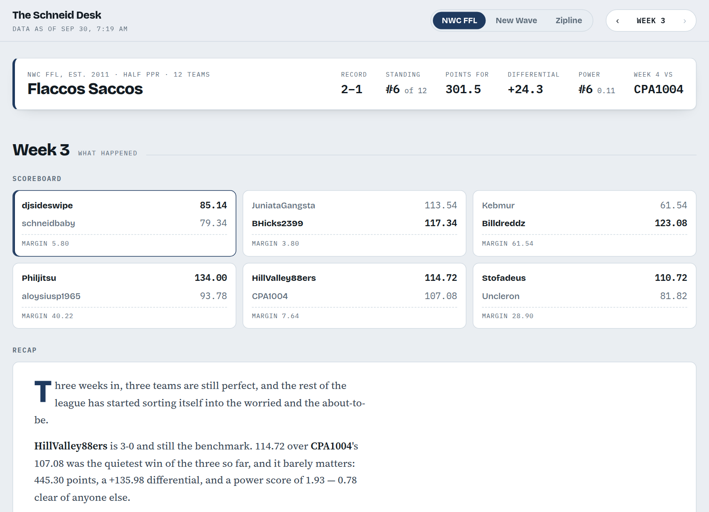
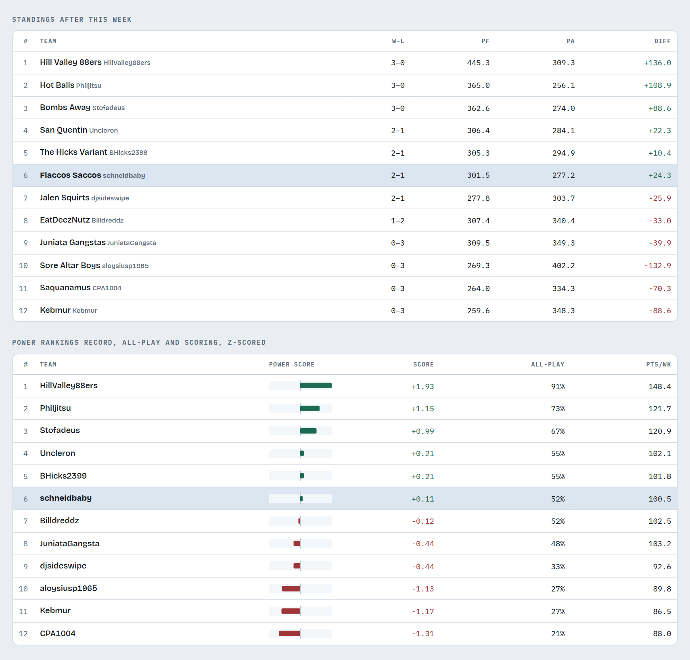
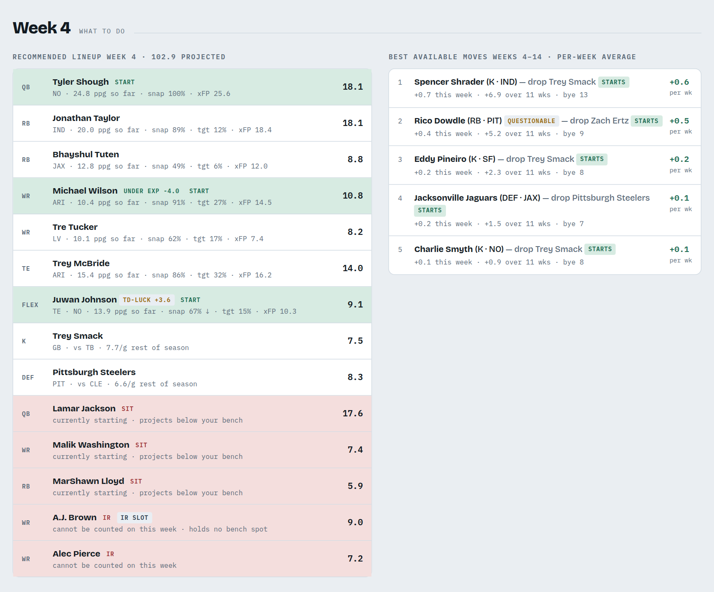
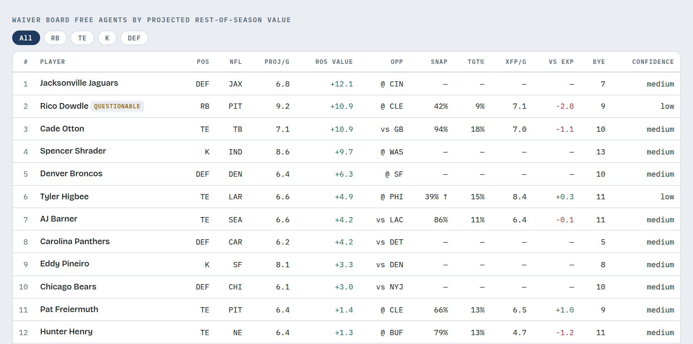

# Fantasy Football Analyzer

A lightweight Python analytics package for fantasy football leagues hosted on
[Sleeper](https://sleeper.com). See `AGENTS.md` for the full project roadmap,
architecture principles, and ticket-based workflow. API reference and usage
guides live under [`docs/`](docs/): [`docs/sleeper.md`](docs/sleeper.md) (the
`sleeper/` layer -- the raw Sleeper HTTP client, exceptions, and player-catalog
cache), [`docs/league.md`](docs/league.md) (the `league/` layer),
[`docs/matchups.md`](docs/matchups.md) (the `matchups/` layer),
[`docs/analytics.md`](docs/analytics.md) (the `analytics/` layer), and the
`players/` layer, split across [`docs/players-data.md`](docs/players-data.md)
(ingestion: nflverse, scoring, the player-week fact table) and
[`docs/players-analytics.md`](docs/players-analytics.md) (performance,
position strength, lineup efficiency, player value, matchup contribution,
lineup tendencies, and the league-wide composite player ranking). For
2026-specific draft analysis, see [`docs/draft-board-2026.md`](docs/draft-board-2026.md)
(pre-draft ranking and availability) and [`docs/draft-grade-2026.md`](docs/draft-grade-2026.md)
(post-draft grading and value analysis).

The initial development and validation season is **2025**, using the Sleeper
username `schneidbaby` as the primary development account. The application is
built to support arbitrary Sleeper users and leagues.

## Season dashboard

The package's pipelines come together in one static page covering every
league a manager plays in: what happened each week, and what to do about the
week coming up. See [`docs/dashboard.md`](docs/dashboard.md) for how it is
built and refreshed.

**Weekly results and recap.** A league and week picker, the manager's
season at a glance, every matchup's score, and a written recap of the week
in which every figure can be traced back to the data.



**Standings and power rankings.** Both are recomputed as of the selected
week, so any earlier week shows the table as it stood then. Power
rankings blend record, all-play win rate and scoring.



**Lineup call and best moves.** The recommended starting lineup for the
coming week, which accounts for injuries and byes, alongside the add/drop
moves that most improve the roster over the rest of the regular season.



**Waiver board.** Every free agent ranked by projected rest-of-season value
over replacement. It uses the league's own scoring settings and shows usage
context: snap share, target share and expected points.



## Project layout

```text
src/
└── fantasy_analyzer/
    ├── sleeper/     # Raw Sleeper API communication and caching
    ├── league/      # League normalization, owner/roster mappings, snapshots
    ├── matchups/    # Weekly matchup retrieval and normalization
    ├── analytics/   # Standings, head-to-head, all-play, luck, power rankings
    └── players/     # Player-provider interfaces, nflverse, scoring, roster efficiency
tests/
```

## Development setup

Create a virtual environment and install the package in editable mode with
its development dependencies:

```bash
python -m venv .venv
.venv/bin/pip install -e ".[dev]"
```

Run the test suite:

```bash
.venv/bin/pytest
```

Run lint/format checks:

```bash
.venv/bin/ruff check .
.venv/bin/ruff format --check .
```

## CLI

Once installed, a `fantasy-analyzer` console script is available for quick
local inspection of a Sleeper league:

```bash
# Find your league_id by listing a user's leagues for a season.
fantasy-analyzer leagues schneidbaby --season 2025

# Print standings and scoring summary for a league.
fantasy-analyzer summary <league_id> --total-weeks 18

# Print a ready-to-paste commentary prompt for a week's matchups.
fantasy-analyzer commentary matchups <league_id> --week 3 --total-weeks 18

# ...or one prompt per matchup instead of a single combined prompt.
fantasy-analyzer commentary matchups <league_id> --week 3 --total-weeks 18 --per-matchup

# Print a ready-to-paste commentary prompt for the league-wide weekly recap.
fantasy-analyzer commentary recap <league_id> --week 3 --total-weeks 18

# Both commentary commands accept --tone (default: witty; also supports
# straightforward). By default neither calls an LLM -- they only print
# prompt text to paste into claude.ai or hand to an agent session.

# ...or pass --generate to call the Claude API directly and print the
# generated commentary instead of the raw prompt (requires ANTHROPIC_API_KEY
# in the environment; uses claude-opus-4-8 at effort="high" by default).
fantasy-analyzer commentary recap <league_id> --week 3 --total-weeks 18 --generate

# Rank a league's free agents by projected rest-of-season points above
# replacement, as of after week 3. See docs/free-agents-cli.md for the full
# argument reference and the local caches the projection model reads.
fantasy-analyzer free-agents <league_id> --season 2026 --week 3

# ...filter to one position, limit to the top N, or print JSON instead.
fantasy-analyzer free-agents <league_id> --season 2026 --week 3 --position WR --top 10 --format json
```

## Notebook

`notebooks/league_walkthrough.ipynb` walks through the league and matchup
analytics against your own live Sleeper data -- league discovery, the
`LeagueSnapshot`, standings, the full matchup normalization pipeline,
head-to-head history, and the Epic 6 advanced league analytics (all-play,
schedule luck, consistency, strength of schedule, power rankings, playoff
brackets). See the notebook's first cell for kernel setup.

`notebooks/roster_analysis.ipynb` runs a full end-to-end roster analysis
for one team's season -- player value, position strength, weekly lineup
efficiency, matchup player contribution, and lineup tendencies (Epic 7,
FFA-064 through FFA-070) -- then applies the same analysis to every team in
the league and compares them with charts (power ranking, lineup
efficiency, schedule luck, a position-strength heatmap, and roster
composition). Also needs the `matplotlib` dev extra; see the notebook's
first cell for kernel setup.
